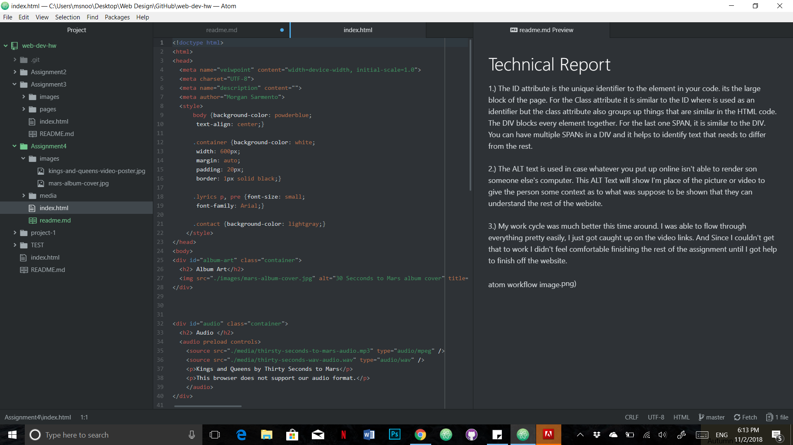

# Technical Report

 1.) The ID attribute is the unique identifier to the element in your code. its the large block of the page. For the Class attribute it is similar to the ID where is used as an identifier but the class attribute also groups up things that are similar in the HTML code. The DIV blocks every element together. For the last one SPAN, it is similar to the DIV. You can have multiple SPANs in a DIV and it helps to identify text that needs to differ from the rest.

 2.) The ALT text is used in case whatever you put up online isn't able to render son someone else's computer. This ALT Text will show I'm place of the picture or video to give the person some context as to what was suppose to be shown that they can understand the rest of the website.

 3.) My work cycle was much better this time around. I was able to flow through everything pretty easily, I just got caught up on the video links. And Since I couldn't get that to work I didn't feel comfortable finishing the rest of the assignment until I got help to finish off the website.

 
