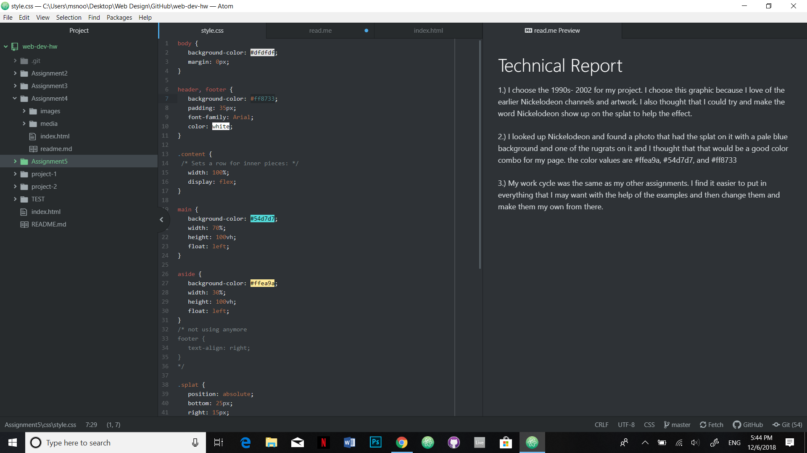

# Technical Report

1.) I choose the 1990s- 2002 for my project. I choose this graphic because I love of the earlier
Nickelodeon channels and artwork. I also thought that I could try and make the word Nickelodeon show up on the splat to help the effect.

2.) I looked up Nickelodeon and found a photo that had
the splat on it with a pale blue background and one of the rugrats on it and I thought
that that would be a good color combo for my page. the color values are  #ffea9a, #54d7d7, and #ff8733

3.) My work cycle was the same as my other assignments. I find it easier to put in everything that I may want with the help of the examples and then change them and make them my own from there.

 
