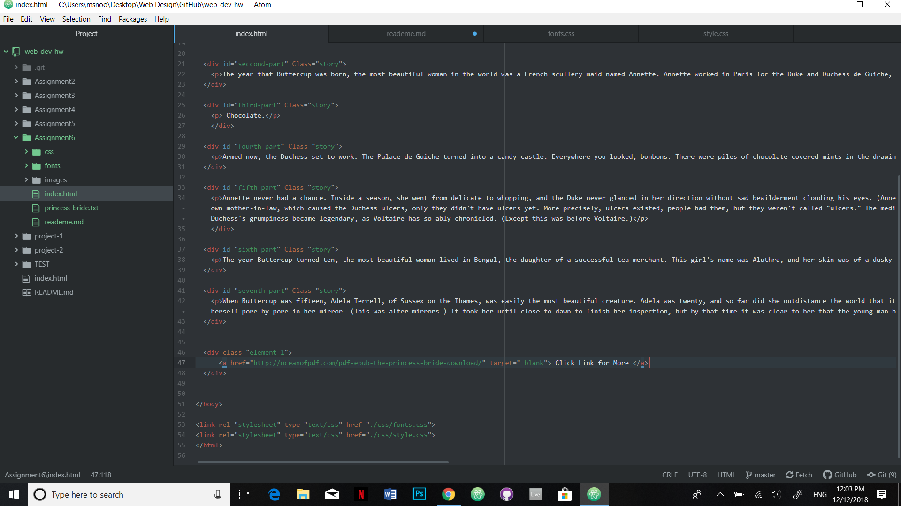

# Technical Report

1.) my Design Process was fairy simple. I wanted something that was simple and had the look of a story book and royalty since I choose the Princess Bride. I chose curly Script like fonts because it went well with my storybook theme.

2.)System fonts should be kept for logos and such because they must be exported as an image so you don't have the file for all the font letters in order to use them in other writings. Web fonts are hosted on a server, hence why its called Web fonts. They are optimized for working on the web so they are great for websites. We-safe fonts are fonts that are the safest to use because every computer had a version of these fonts on their computer whether it be Mac or windows. Fall Back fonts are great to make sure that your text can be read and legible. some fonts may not show up on a server and some may look weird one they are on the web so having a backup that looks similar is always nice to have.

3.) This was a simple project since I've been working with typography for many of the other projects. The hardest part was to try and figure out how to change the font on my title. I had to change the Class and redo the info for the style so that putting a font family on it would work.

 
