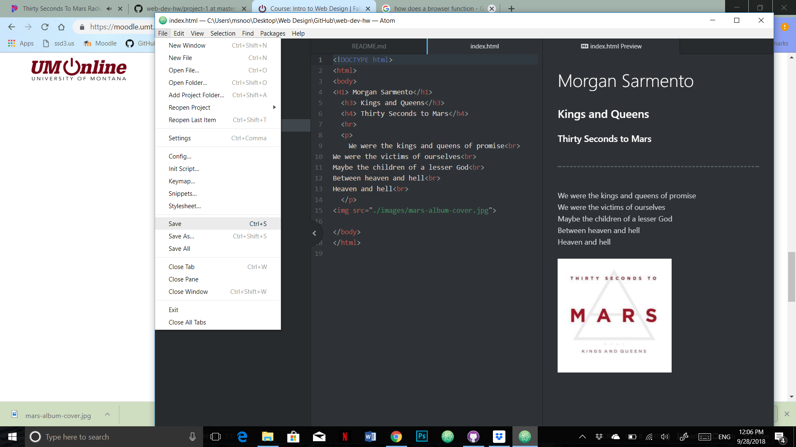

# Morgan Sarmento Technical report
---
My main browser that I utilize is Chrome
I've used chrome for most of my life so I'm pretty use to it. A browser like Chrome reads the markup language and HTML language that is written in the code to load the page the way the maker intends it to. Different browsers may show pages differently because they use different readers to read the language that is presented to them and its then interpreted differently. It woks like and interpreter that changes the HTLM langue to something the browser can understand and show.

I really enjoyed the way back machine. I went all the way beck to the first webpage for the university of Montana and it was drastically different then what we see now. I also looked at the year 2008 and that was surreal for me because I was in elementary school and I remember when webpages use to look very simple and funny looking.

My work cycle was way better this time around. I understood HTML better since I did it in high school and I even made a webpage before. I tried to make many different pages before making the actually project so that I could get a feel for the layout and how to source images. I still cant make the webpage show up on my web dev so I might need help to find out what went wrong.

