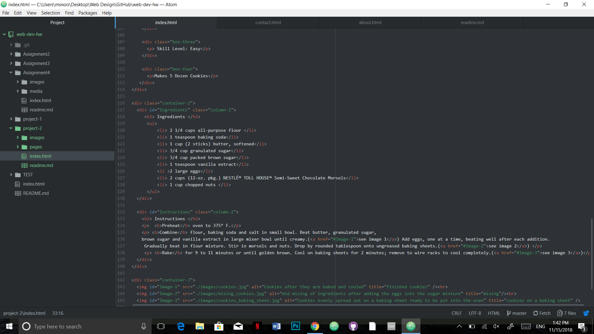

# Technical Write up

 1.) Since I have done HTLM in high school some of the basic stuff I already new but it was nice to relearn. This was like setting up the web document and some of the styling aspects like color. I did learn how to organize the page better and make columns. I also really liked learning how to class the different parts of the HTML.

 2.)Since I did some styling already I'm really excited to be able to learn how to make it more unique of a page and make it look better. Right now the websites and pages are all bland and boring and I'm excited to know how to add more elements and color to the page to make it stand out.

 3.) My work cycle for this project was to first outline the page with all the elements I knew how to put in. Before I even knew what I wanted my website to be about I wanted to make an outline so that I don't forget anything and so I have an easier time just plug in in the information. After that I plugged in all the information and just spent the rest of the time editing the style and look of the website.

 
