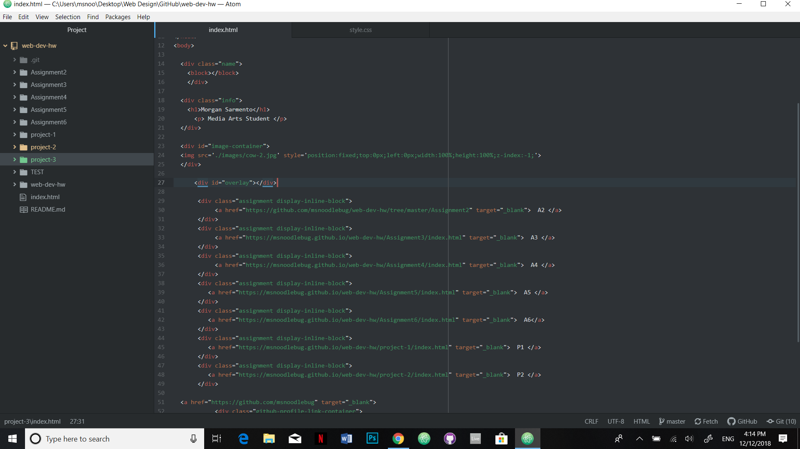

# Technical Writeup

1.) Padding is how much cushion is around the text relative to the boarder. boarders are lines that outline the image, text or box you want to outline. They can be dotted embossed or plain and you can change the colors of your boarders. margin is the outside of the boarder that gives you space for other colors.

2.)There were two hard parts that I'm still struggling on and cant seem to fix with this project. One is the Z-index. I'm not sure how to use it and I don't know how to add it to my website. The other thing that I am having trouble with is the placement of my buttons to my other projects. No matter what I do I cant seem to get them to move to a different area of the page.

3.) It was easy to get stated with this one since the layout was simple and similar to all the other projects we have done so far. I then added the different elements and picked colors that when with my background and my theme of cows.

